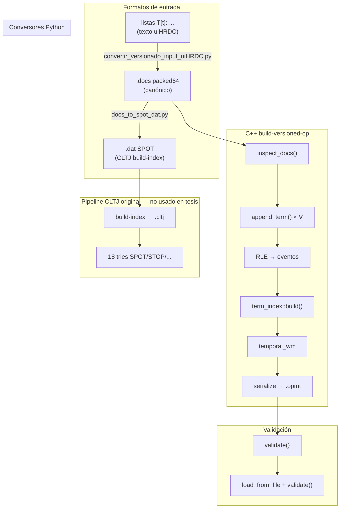

# ST[OP] versionado — flujo, funciones e inputs

> **Actualización MAGISTER:** la implementación canónica vive en
> [`edd_metatrie/meta_trie_edd.cpp`](../edd_metatrie/meta_trie_edd.cpp)
> (`edd::versioned_op_metatrie` inline). Se retiraron de BGPs
> `include/versioned_op_metatrie.hpp` y `src/build-versioned-op.cpp`.

Documentación histórica del experimento **metatrie ST[OP]** adaptado de CLTJ.  
Pipeline actual: **`.docs` packed64 → `edd_metatrie/meta_trie_edd` → métricas BPI / `.emt`**.

---

## 1. Modelo de datos (2 ejes)

| Eje | Rol | Origen |
|-----|-----|--------|
| **S** | término (`term_id`) | índice externo del vector `m_terms` |
| **T** | versión relativa (`rel`) | campo bajo 24 bit del packed64 |
| **O** | master (página) | campo alto 40 bit del packed64 |
| **P** | — | no usado (`p=0` si se convierte a `.dat`) |

**Consulta:** dado `(term, rel)` → conjunto de `master` activos en esa versión.

**Modo recomendado:** `n_tuple_components = 1`  
- Payload del WM = solo `master`  
- `T` vive en `m_times` + eventos insert/delete  
- RLE sobre corridas consecutivas de `rel` por `(term, master)`  
- **Lossless** respecto al set de pares `(term, master, rel)`

**Modo control (descartado):** `n=2` repite `rel` en T y en payload `(master, rel)` → ~137 bpi, peor que packed64.

---

## 2. Arquitectura del repo

**Diagrama BGPs (recomendado):** [`diagramas/flujo-st-op-bgps.drawio`](diagramas/flujo-st-op-bgps.drawio) · [`diagramas/flujo-st-op-bgps.png`](diagramas/flujo-st-op-bgps.png)  
**Diagrama MAGISTER global (legacy):** [`diagramas/flujo-st-op-test.drawio`](diagramas/flujo-st-op-test.drawio)



---

## 3. Archivos y responsabilidades

| Archivo | Rol |
|---------|-----|
| `bgps-temporal-graphs/include/versioned_op_metatrie.hpp` | Metatrie ST[OP]: vector de `term_index`, RLE, consultas |
| `bgps-temporal-graphs/include/cltj_temporal_wm.hpp` | VBT compacto (bitvectors B/E), `leap`, `get_root` |
| `bgps-temporal-graphs/src/build-versioned-op.cpp` | CLI: lee `.docs`, construye, valida, serializa |
| `BGPs/compare_input_formats.py` | Prueba equivalencia A↔B↔C↔D sin pérdida |
| `BGPs/docs_to_spot_dat.py` | `.docs` → `.dat` SPOT (una línea/posting) |
| `BGPs/inspect_docs_para_metatrie.py` | Auditor semántica `rel` + factor RLE |
| `BGPs/make_toy_versioned_docs.py` | Toy `.docs` para tests |
| `BGPs/run_st_op_n_tuple.sh` | Batch n=1/n=2 sobre datasets tesis |
| `BGPs/run_input_format_experiments.sh` | Equivalencia + validación exhaustiva 100 MB |
| `scripts/convertir_versionado_input_uiHRDC.py` | Texto `T[t]:` → `.docs` packed64 |

**Salidas:** `BGPs/resultados_opmt/*.opmt`  
**CSV:** `BGPs/resultados_st_op_n_tuple_components.csv`, `BGPs/resultados_input_formats.csv`

---

## 4. Formato `.docs` packed64 (input canónico)

```
uint32 nlists
repeat nlists veces:
    uint32 len
    uint64 packed[len]   // master = packed >> 24, rel = packed & 0xFFFFFF
```

- Sin header extra; `term_id` = posición 0..nlists−1.
- Duplicados `(master, rel)` se deduplican al construir eventos.
- **No se pierde información** si la semántica es membership en versiones enteras.

---

## 5. Formatos alternativos (comparación)

| ID | Formato | Entrada típica | Pérdida | Uso |
|----|---------|----------------|---------|-----|
| **A** | `.docs` packed64 | pipeline uiHRDC | Ninguna | **Recomendado** — directo a `build-versioned-op` |
| **B** | Pares `(term, master, rel)` | expansión lógica de A | Ninguna | Modelo mental / validación Python |
| **C** | Intervalos RLE `(term, master, v1..v2)` | lo que `append_term` materializa (n=1) | Ninguna | Representación interna; ~78× menos eventos que postings (100 MB) |
| **D** | `.dat` SPOT texto | `s p o t1 t2` por posting | Ninguna* | Compatible con `build-index` CLTJ (*distinto índice, no `.opmt`) |
| **E** | Listas texto `T[t]: (m,r)` | export uiHRDC | Ninguna | → A vía `convertir_versionado_input_uiHRDC.py` |

### Mapeo A → D (SPOT)

```
S = term_id
P = 0
O = master
t1 = rel
t2 = rel        # build-index hace t2+1 → intervalo [rel, rel+1)
```

### Equivalencia verificada (100 MB, 9 774 términos)

```
postings únicos : 5 424 820
intervalos RLE  : 69 512
factor RLE      : 78.04×
pairs == expand(RLE): True
```

Muestra 2 GB (5 000 términos): factor RLE **27.98×**, equivalencia **True**.

---

## 6. Funciones clave (C++)

### 6.1 `build-versioned-op.cpp`

| Función | Descripción |
|---------|-------------|
| `inspect_docs(path, max_terms)` | Escaneo: offsets, `max_master`, `max_relative`, conteo postings |
| `read_posting_list(in, offset, out)` | Lee una posting list del `.docs` |
| `bits_required(value)` | `ceil(log2(max))` para ancho del WM |
| `validation_times(postings)` | Tiempos borde para validación (rel, rel±1, …) |
| `expected_at(postings, rel, components)` | Ground truth: n=1 intervalos RLE; n=2 punto exacto |
| `validate(index, docs, metadata, n_terms)` | Compara `values_at` vs `expected_at` |
| `main()` | Orquesta build → validate → serialize → load → validate |

**CLI:**

```bash
build-versioned-op <components:1|2> <input.docs> <output.opmt> [max_terms=0] [validate_terms=100]
```

### 6.2 `versioned_op_metatrie` (`versioned_op_metatrie.hpp`)

| Función / método | Descripción |
|------------------|-------------|
| `unpack_master(packed)` | `packed >> 24` |
| `unpack_relative(packed)` | `packed & 0xFFFFFF` |
| `append_term(postings)` | **Punto de entrada por término.** n=1: dedup + RLE → eventos insert/delete; n=2: 2 eventos/posting |
| `term_index::build(events, components, bits)` | Ordena eventos, arma `m_times`, `m_last_update`, construye `temporal_wm` |
| `term_index::state_position(rel, pos)` | Búsqueda binaria: último timestamp ≤ rel |
| `term_index::values_at(rel, components)` | Recorre WM con `leap()` → lista de `(master)` o `(master, rel)` |
| `values_at(term, rel)` | Delega al `term_index` del término |
| `serialize` / `load` | Formato `.opmt` (SDSL) |

#### RLE en `append_term` (n=1)

Para cada `(master, rel)` ordenado:

1. Agrupa corridas consecutivas de `rel` por el mismo `master`.
2. Por intervalo `[start, previous]`:
   - **insert** en `T=start` con payload `master`
   - **delete** en `T=previous+1`

Semántica de consulta: `master` está activo en todo entero `rel ∈ [start, previous]`.

### 6.3 `temporal_wm` (`cltj_temporal_wm.hpp`)

| Función | Descripción |
|---------|-------------|
| Constructor `(updates, delete_flags, n_components, bits, is_partial)` | Construye VBT B/E desde tuplas SPOT |
| `get_root()` | Raíz del trie temporal |
| `leap(level, …)` | Sucesor en el WM para enumerar valores en un timestamp |
| `get_n_bits()` | Bits por componente del payload |
| `serialize` / `load` | Persistencia SDSL |

En n=1: `is_partial = false`, `n_components = 1`, payload = solo `O=master`.

---

## 7. Flujo end-to-end (comandos)

### Compilar

```bash
cd /root/MAGISTER/BGPs/bgps-temporal-graphs/build
cmake .. && make build-versioned-op
```

### Build canónico (n=1, corpus completo)

```bash
./build-versioned-op 1 \
  /root/MAGISTER/resultados_test/wiki_2gb_uihrdc_packed64.docs \
  /root/MAGISTER/BGPs/resultados_opmt/wiki_2gb_n1.opmt \
  0 500
```

### Validación exhaustiva (todos los términos, 100 MB)

```bash
./build-versioned-op 1 \
  /root/MAGISTER/resultados_test/wiki_100mb_uihrdc_packed64.docs \
  /root/MAGISTER/BGPs/resultados_opmt/wiki_100mb_n1_fullvalidate.opmt \
  0 9774
# → validation=PASS roundtrip=PASS (sep 2026)
```

### Comparar formatos de input

```bash
python3 /root/MAGISTER/BGPs/compare_input_formats.py <file.docs> [max_terms]
python3 /root/MAGISTER/BGPs/docs_to_spot_dat.py <file.docs> <out.dat> [--max-terms N]
bash /root/MAGISTER/BGPs/run_input_format_experiments.sh
```

### Texto uiHRDC → `.docs`

```bash
python3 /root/MAGISTER/scripts/convertir_versionado_input_uiHRDC.py \
  --input listas_versionadas.txt --output salida.docs
```

---

## 8. Validación y criterio de no-pérdida

1. **Por intervalos (n=1):** para cada término y tiempos borde, `values_at(term, rel)` debe coincidir con masters cuyo intervalo RLE contiene `rel`.
2. **Round-trip:** serializar → liberar RAM → cargar `.opmt` → re-validar.
3. **Equivalencia Python:** `pairs_from_docs == expand(rle_intervals)` (`compare_input_formats.py`).

**Límites actuales:**

- Validación en corpus grande es **muestral** (200–500 términos) salvo corrida explícita 100 MB completa.
- n=1 no almacena `rel` en el payload; la reconstrucción del set de pares requiere expandir intervalos (o conservar el `.docs` original).

---

## 9. Resultados BPI

**Métrica ST[OP]:** `bpi_file = file_bytes × 8 / n_raw` (postings packed64).

### ST[OP] n=1 (`resultados_st_op_n_tuple_components.csv`)

| Dataset | términos | n_raw | updates | bits | bytes | bpi_file | build (s) |
|---------|----------|-------|---------|------|-------|----------|-----------|
| wiki_100mb | 9 774 | 5.4M | 139 024 | 4 | 1.67 MB | **2.46** | 0.17 |
| wiki_1gb | 147 992 | 61.4M | 3.0M | 11 | 33.8 MB | **4.40** | 4.2 |
| wiki_2gb | 250 550 | 122.2M | 6.0M | 13 | 64.4 MB | **4.21** | 8.8 |

Validación exhaustiva 100 MB: **9 774/9 774 términos PASS**.

### vs `plus_t` ZDD (`resultados_test/plus_t_bpi_ladder.csv`)

| Escala | ST[OP] n=1 bpi_file | plus_t bpi_edd (opt) | Notas |
|--------|---------------------|----------------------|-------|
| 100 MB | 2.46 | ~0.51 | ZDD gana; métrica RAM nodos vs disco SDSL |
| 1 GB | 4.40 | ~21.34 | Metatrie ~5× menor en disco |
| 2 GB | 4.21 | ~35.21 | Metatrie ~8× menor en disco |

**Interpretación:** métricas distintas (`bpi_file` sobre postings vs `bpi_edd` sobre nodos CUDD). ST[OP] n=1 escala bien en disco; plus_t comprime más en RAM a 100 MB pero crece más en 1–2 GB.

### n=2 (solo control)

~137–144 bpi_file; `updates ≈ 2 × n_raw`. No usar en producción.

---

## 10. Cuándo usar cada pipeline

| Objetivo | Pipeline |
|----------|----------|
| Índice versionado 2-ejes (T+O), disco compacto | **`.docs` → `build-versioned-op` n=1 → `.opmt`** |
| Mismo dato en CLTJ SPOT (grafos, 18 tries) | `.docs` → `docs_to_spot_dat.py` → `build-index` |
| Desde export uiHRDC texto | `convertir_versionado_input_uiHRDC.py` → `.docs` → arriba |
| EDD con sharing global (tesis principal) | uiHRDC → `zdd_cudd_plus_t` → `.zpack` |

---

## 11. Iteración sep 2026 (esta sesión)

- [x] Equivalencia formal A/B/C/D (`compare_input_formats.py`)
- [x] Conversor `.docs` → `.dat` SPOT (`docs_to_spot_dat.py`)
- [x] Validación **exhaustiva** wiki_100mb n=1 (9 774 términos)
- [x] Rebuild wiki_2gb n=1 con validación 500 términos
- [x] Documentación de flujo y funciones (este archivo)

**Conclusión:** el input canónico `.docs` packed64 es lossless y suficiente; no hace falta pipeline intermedio. RLE interno (n=1) comprime ~78× los eventos en 100 MB sin perder pares `(term, master, rel)`.
