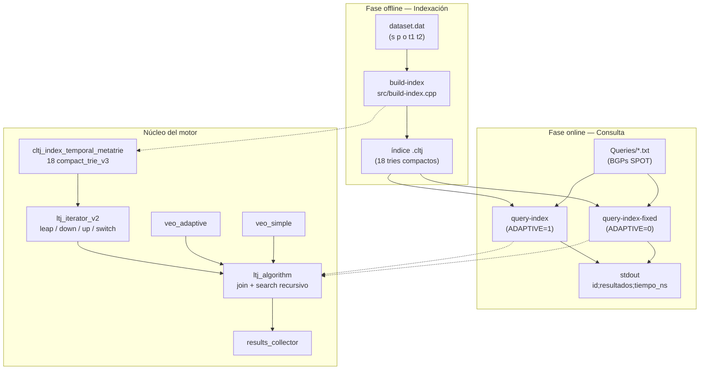
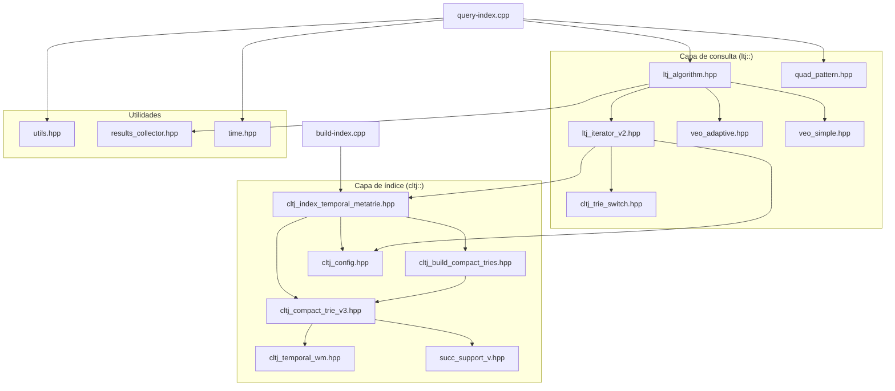
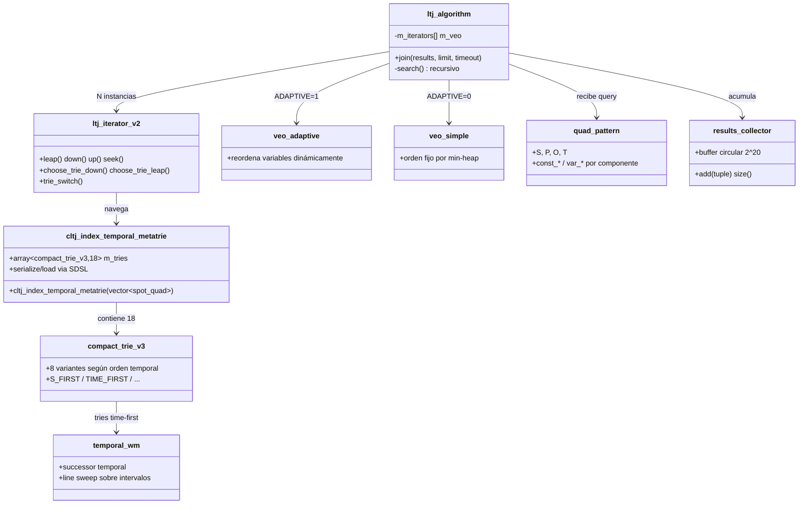

# Mapa de Conocimiento — `bgps-temporal-graphs`

> **Ruta del proyecto:** `/root/MAGISTER/BGPs/bgps-temporal-graphs`  
> **Repositorio remoto:** `https://github.com/darroyue/bgps-temporal-graphs`  
> **Generado:** 2026-09-06

---

## Índice

1. [Resumen ejecutivo](#1-resumen-ejecutivo)
2. [Grafo de arquitectura](#2-grafo-de-arquitectura)
3. [Estructura de directorios](#3-estructura-de-directorios)
4. [Flujo de datos end-to-end](#4-flujo-de-datos-end-to-end)
5. [Catálogo de archivos](#5-catálogo-de-archivos)
6. [Grafo de dependencias entre módulos](#6-grafo-de-dependencias-entre-módulos)
7. [Componentes clave y relaciones](#7-componentes-clave-y-relaciones)
8. [Los 18 tries del índice](#8-los-18-tries-del-índice)
9. [Formatos de entrada y salida](#9-formatos-de-entrada-y-salida)
10. [Guía de navegación del código](#10-guía-de-navegación-del-código)
11. [Compilación y ejecución](#11-compilación-y-ejecución)
12. [Benchmarks y resultados](#12-benchmarks-y-resultados)
13. [Glosario](#13-glosario)
14. [Limitaciones y notas](#14-limitaciones-y-notas)

---

## 1. Resumen ejecutivo

**CLTJ** (*Compact Leap-Trie Join*) es un motor de consultas C++ para resolver **BGPs** (*Basic Graph Patterns*, patrones de grafo básicos) sobre **grafos temporales RDF**.

Cada arista del grafo se modela como una **cuádrupla SPOT**:

| Componente | Significado |
|------------|-------------|
| **S** | Subject (sujeto) |
| **P** | Predicate (predicado) |
| **O** | Object (objeto) |
| **T** | Intervalo temporal `[t1, t2]` |

El sistema opera en **dos fases**:

| Fase | Ejecutable | Entrada | Salida |
|------|------------|---------|--------|
| **Indexación offline** | `build-index` | Archivo `.dat` | Índice `.cltj` (18 tries compactos serializados) |
| **Consulta online** | `query-index` / `query-index-fixed` | Índice `.cltj` + archivo de queries | Resultados + tiempos por query |

**Algoritmos centrales:**
- **LTJ** (*Leap-Trie Join*): join recursivo sobre tries con operación *leap* (salto de ramas)
- **VEO** (*Variable Evaluation Order*): heurística para ordenar variables durante el join
  - `query-index` → VEO adaptivo (`ADAPTIVE=1`)
  - `query-index-fixed` → VEO fijo/simple (`ADAPTIVE=0`)
- **Trie switching**: cambio dinámico entre los 18 tries según el patrón de consulta

**Dependencia externa crítica:** [SDSL-lite extendido](https://github.com/darroyue/sdsl-lite) instalado en `~/include` y `~/lib`.

---

## 2. Grafo de arquitectura



---

## 3. Estructura de directorios

```
/root/MAGISTER/BGPs/bgps-temporal-graphs/
│
├── src/                          ← Puntos de entrada (2 ejecutables)
│   ├── build-index.cpp           ← Construcción del índice
│   └── query-index.cpp           ← Ejecución de queries (compilado 2 veces)
│
├── include/                      ← Toda la lógica core (headers template-heavy)
│   ├── [ÍNDICE] cltj_index_temporal_metatrie.hpp, cltj_compact_trie_v3.hpp, ...
│   ├── [CONSTRUCCIÓN] cltj_build_compact_tries.hpp, cltj_temporal_wm.hpp
│   ├── [CONSULTA] ltj_algorithm.hpp, ltj_iterator_v2.hpp, veo_*.hpp
│   ├── [PATRONES] quad_pattern.hpp, triple_pattern.hpp
│   ├── [CONFIG] cltj_config.hpp, configuration.hpp
│   └── [LEGACY] cltj_index_metatrie.hpp, ltj_iterator.hpp, ...
│
├── CMakeModules/                 ← Macros CMake
│   ├── AppendCompilerFlags.cmake
│   └── CheckSSE.cmake
│
├── Queries/                      ← Benchmarks de consultas BGP
│   ├── Queries-bgps-limit1000.txt    ← Benchmark principal (~1296 queries)
│   ├── type1/2/3.Queries-bgps-limit1000.txt
│   ├── types.txt                     ← Mapeo query_id → TYPE1/2/3
│   ├── Queries-wikidata-benchmark.txt
│   └── type3.sparql.txt              ← Ejemplo en formato SPARQL
│
├── results/                      ← Salidas experimentales del paper
│   ├── large/                    ← Dataset grande, límite 1000
│   ├── large-nolimit/            ← Sin límite de resultados
│   ├── filtered/                 ← Dataset filtrado
│   └── uncltj/                   ← Comparación con versión no-CLTJ
│
├── CMakeLists.txt                ← Build system (proyecto CLTJ)
├── README.md                     ← Instrucciones oficiales
└── .git/                         ← Repo Git
```

**Lo que NO existe en el repo:**
- Directorio `tests/` (sin tests automatizados)
- Directorio `docs/` (solo README)
- Scripts auxiliares
- Datasets (disponibles en Zenodo)

---

## 4. Flujo de datos end-to-end

### 4.1 Construcción del índice

```
┌─────────────────────────────────────────────────────────────────┐
│  dataset.dat                                                    │
│  ┌──────────────────────────────────────────────────────────┐   │
│  │ Header: 3 enteros (metadatos del grafo)                  │   │
│  │ Tuplas: s p o t1 t2  (repetidas, una por línea)          │   │
│  └──────────────────────────────────────────────────────────┘   │
└────────────────────────────┬────────────────────────────────────┘
                             │ build-index.cpp
                             ▼
┌─────────────────────────────────────────────────────────────────┐
│  vector<spot_quad> D                                          │
│  spot[0]=S, spot[1]=P, spot[2]=O, spot[3]=t1, spot[4]=t2+1   │
│  (intervalo semi-abierto [t1, t2+1))                           │
└────────────────────────────┬────────────────────────────────────┘
                             │ cltj_index_temporal_metatrie(D)
                             ▼
┌─────────────────────────────────────────────────────────────────┐
│  18 tries compactos (compact_trie_v3)                           │
│  ├─ 12 tries "normales" (S/P/O primero): SPOT, SPT, SO, ST,    │
│  │   POS, POT, PS, PT, OSP, OST, OP, OT                        │
│  └─ 6 tries "time-first" (T primero): TSPO, TSO, TPOS, TPS,    │
│      TOSP, TOP  (+ temporal_wm con line sweep)                  │
└────────────────────────────┬────────────────────────────────────┘
                             │ sdsl::store_to_file()
                             ▼
                      dataset.dat.cltj
```

### 4.2 Ejecución de consultas

```
┌─────────────────────────────────────────────────────────────────┐
│  queries.txt — una query por línea                              │
│  Formato: "quad1 . quad2 . quad3 ..."                           │
│  Cada quad: 4 tokens separados por espacio                      │
│    "?v0 12 428 ?v1"  o  "49409111 ?v2 ?v1 100"                  │
│  Variables: prefijo '?'                                          │
└────────────────────────────┬────────────────────────────────────┘
                             │ query-index.cpp
                             ▼
┌─────────────────────────────────────────────────────────────────┐
│  vector<quad_pattern> query                                     │
│  (cada quad = S, P, O, T con constantes o variables)            │
└────────────────────────────┬────────────────────────────────────┘
                             │ ltj_algorithm::join(res, limit, 600)
                             ▼
┌─────────────────────────────────────────────────────────────────┐
│  Búsqueda recursiva (search):                                   │
│  1. VEO determina orden de variables                            │
│  2. ltj_iterator_v2 por cada quad del BGP                       │
│  3. seek / leap / down / up sobre tries                         │
│  4. trie switching según trie_map_* en cltj_config.hpp          │
│  5. Manejo especial de variables temporales (intervalos)        │
│  6. results_collector acumula bindings                          │
└────────────────────────────┬────────────────────────────────────┘
                             ▼
              stdout: "0;1000;69370240416"
              (query_id ; num_resultados ; tiempo_nanosegundos)
```

---

## 5. Catálogo de archivos

### 5.1 Puntos de entrada (`src/`)

| Archivo | Rol | Detalle |
|---------|-----|---------|
| `src/build-index.cpp` | Construcción del índice | Lee `.dat`, crea `cltj_index_temporal_metatrie<compact_trie_v3>`, serializa a `<dataset>.cltj` |
| `src/query-index.cpp` | Motor de consultas | Parsea queries, instancia LTJ+VEO, imprime resultados. Compilado **dos veces** con distinto `ADAPTIVE` |

### 5.2 Configuración y build

| Archivo | Rol |
|---------|-----|
| `CMakeLists.txt` | Proyecto CLTJ, C++11, Release -O3, SSE4.2. Genera 3 ejecutables. Paths hardcodeados: `~/include`, `~/lib` |
| `CMakeModules/AppendCompilerFlags.cmake` | Macro para agregar flags de compilador |
| `CMakeModules/CheckSSE.cmake` | Detección de soporte SSE4.2 |
| `include/cltj_config.hpp` | **Configuración central**: tipos SPOT, 18 órdenes de trie, tablas de trie switching (`trie_map_*`) |
| `include/configuration.hpp` | Tipos SDSL, enum `state_type {s, p, o, t}` |

### 5.3 Índice — construcción (`include/`)

| Archivo | Rol | Estado |
|---------|-----|--------|
| `cltj_index_temporal_metatrie.hpp` | **Índice principal temporal**: array de 18 tries, typedef `compact_temporal_ltj_metatrie` | **ACTIVO** |
| `cltj_compact_trie_v3.hpp` | Trie compacto con soporte temporal (8 variantes: S_FIRST, TIME_FIRST, etc.) | **ACTIVO** |
| `cltj_build_compact_tries.hpp` | Funciones de construcción: `create_full_trie_SPOT`, `create_time_first_trie`, `generate_list_of_updates` | **ACTIVO** |
| `cltj_temporal_wm.hpp` | Estructura persistente **temporal_wm** (successor temporal con line sweep) | **ACTIVO** |
| `succ_support_v.hpp` | Soporte `succ0` custom para tries (namespace `cds`) | **ACTIVO** |

### 5.4 Consulta — algoritmo (`include/`)

| Archivo | Rol | Estado |
|---------|-----|--------|
| `ltj_algorithm.hpp` | **Algoritmo LTJ**: `join()`, `search()` recursivo con timeout (600s) y límite de resultados | **ACTIVO** |
| `ltj_iterator_v2.hpp` | **Iterador sobre tries**: `leap`, `down`, `up`, `seek`, `choose_trie_down/leap`, trie switching | **ACTIVO** |
| `veo_adaptive.hpp` | Orden adaptivo de variables (listas, versiones, variables solitarias) | **ACTIVO** (query-index) |
| `veo_simple.hpp` | Orden fijo basado en min-heap por peso de variables | **ACTIVO** (query-index-fixed) |
| `quad_pattern.hpp` | Patrón de consulta SPOT (constantes vs variables) | **ACTIVO** |
| `cltj_trie_switch.hpp` | Lógica de cambio entre trie normal y temporal | **ACTIVO** (incluido en iterator) |
| `utils.hpp` | Traits VEO: `trait_distinct` (nº hijos), `trait_size` (tamaño subárbol) | **ACTIVO** |
| `results_collector.hpp` | Acumulador circular de resultados (bucket 2^20) | **ACTIVO** |

### 5.5 Utilidades

| Archivo | Rol |
|---------|-----|
| `time.hpp` | Medición de tiempo/recursos (`util::time::usage`) |
| `math_util.hpp` | Utilidades matemáticas |
| `triple_pattern.hpp` | Patrón SPO legacy (no usado en flujo temporal actual) |

### 5.6 Legacy — no activos en el flujo principal

| Archivo | Descripción |
|---------|-------------|
| `cltj_index_metatrie.hpp` | Índice no temporal (6 tries SPO), typedef `compact_ltj_metatrie` |
| `cltj_index_spo.hpp` | Índice SPO antiguo, typedef `compact_ltj` |
| `cltj_compact_trie_v2.hpp` | Versión anterior del trie compacto |
| `cltj_regular_trie.hpp`, `cltj_regular_trie_v2.hpp` | Tries no compactos |
| `cltj_uncompact_trie_v2.hpp` | Trie no compacto v2 |
| `cltj_metatrie.hpp` | Meta-trie genérico anterior |
| `ltj_iterator.hpp` | Iterador v1 (reemplazado por v2) |

### 5.7 Queries y resultados

| Archivo | Contenido |
|---------|-----------|
| `Queries/Queries-bgps-limit1000.txt` | Benchmark principal (~1296 queries BGP) |
| `Queries/type1.Queries-bgps-limit1000.txt` | Subconjunto TYPE1 (queries más simples) |
| `Queries/type2.Queries-bgps-limit1000.txt` | Subconjunto TYPE2 (intermedias) |
| `Queries/type3.Queries-bgps-limit1000.txt` | Subconjunto TYPE3 (complejas, IDs 0–697) |
| `Queries/types.txt` | Mapeo `query_id;TYPE1\|TYPE2\|TYPE3` |
| `Queries/Queries-wikidata-benchmark.txt` | Benchmark alternativo Wikidata |
| `Queries/type3.sparql.txt` | Formato SPARQL de ejemplo |
| `results/large/cltj-normal.csv` | Salida ejemplo: `query_id;resultados;tiempo_ns` |
| `results/*/` | CSVs y `.out` de experimentos del paper (normal, star, adap, filtered, uncltj) |

---

## 6. Grafo de dependencias entre módulos



### Namespaces

| Namespace | Contenido |
|-----------|-----------|
| `cltj::` | Índice, tries, configuración SPOT, construcción |
| `ltj::` | Algoritmo join, patrones, iteradores |
| `ltj::veo::` | Variable Evaluation Order (adaptive / simple) |
| `ltj::util::` | Traits heurísticos (`trait_distinct`, `trait_size`) |
| `util::` | `results_collector`, `time` |
| `cds::` | `succ_support_v` |
| `sdsl::` | Librería externa (bit vectors, serialización) |

---

## 7. Componentes clave y relaciones



### Tipos de datos fundamentales

```cpp
// cltj_config.hpp
typedef std::array<uint32_t, 5> spot_quad;   // [S, P, O, t_start, t_end]
typedef std::array<uint32_t, 3> spo_triple;  // legacy SPO

// ltj_algorithm.hpp
typedef vector<pair<var_type, value_type>> tuple_type;  // binding de variables
```

### Configuración activa en consultas

En `query-index.cpp` línea 272:
```cpp
query<cltj::compact_temporal_ltj_metatrie, ltj::util::trait_distinct>(index, queries, limit);
```

- **Índice:** `compact_temporal_ltj_metatrie` (= `cltj_index_temporal_metatrie<compact_trie_v3>`)
- **Trait VEO:** `trait_distinct` (heurística basada en número de hijos distintos)
- **Alternativa comentada:** `trait_size` (basada en tamaño de subárbol)

---

## 8. Los 18 tries del índice

Definidos en `include/cltj_config.hpp`:

| Índice | Macro | Orden | Categoría | Función de construcción |
|--------|-------|-------|-----------|------------------------|
| 0 | SPOT | S-P-O-T | Completo, S primero | `create_full_trie_SPOT` |
| 1 | SPT | S-P-T | Parcial con T | `create_partial_trie_2T` |
| 2 | SO | S-O | 2 niveles | `create_partial_trie_2` |
| 3 | ST | S-T | 2 niveles + T | `create_partial_trie_1T` |
| 4 | POS | P-O-S | 3 niveles sin T | `create_full_trie_no_t` |
| 5 | POT | P-O-T | 3 niveles + T | `create_partial_trie_2T` |
| 6 | PS | P-S | 2 niveles | `create_partial_trie_2` |
| 7 | PT | P-T | 2 niveles + T | `create_partial_trie_1T` |
| 8 | OSP | O-S-P | 3 niveles sin T | `create_full_trie_no_t` |
| 9 | OST | O-S-T | 3 niveles + T | `create_partial_trie_2T` |
| 10 | OP | O-P | 2 niveles | `create_partial_trie_2` |
| 11 | OT | O-T | 2 niveles + T | `create_partial_trie_1T` |
| 12 | TSPO | T-S-P-O | Time-first completo | `create_time_first_trie` |
| 13 | TSO | T-S-O | Time-first parcial | `create_time_first_trie` |
| 14 | TPOS | T-P-O-S | Time-first | `create_time_first_trie` |
| 15 | TPS | T-P-S | Time-first parcial | `create_time_first_trie` |
| 16 | TOSP | T-O-S-P | Time-first | `create_time_first_trie` |
| 17 | TOP | T-O-P | Time-first parcial | `create_time_first_trie` |

**Tablas de trie switching** (en `cltj_config.hpp`):
- `trie_map_leap_2`, `trie_map_2` — switching con 2 variables unidas
- `trie_map_leap_3`, `trie_map_3` — switching con 3 variables unidas

Cada entrada es un `trie_status_pair { trie_id, switch_flag, status }`.

---

## 9. Formatos de entrada y salida

### 9.1 Dataset `.dat`

```
<entero_a> <entero_b> <entero_c>     ← header (3 metadatos)
<s> <p> <o> <t1> <t2>                ← cuádrupla 1
<s> <p> <o> <t1> <t2>                ← cuádrupla 2
...
```

- Todos los valores son enteros `uint32`
- Internamente: `t2` se almacena como `t2+1` (intervalo semi-abierto `[t1, t2+1)`)
- El header se imprime al cargar: `"loading graph a b c"`

### 9.2 Archivo de queries

```
?v0 ?v1 ?v2 ?v3 . ?v0 12 ?v4 ?v5 . ?v2 208 ?v4 ?v6
?v2 12 428 ?v1 . ?v2 208 ?v4 ?v2 . ?v2 209 ?v3 ?v2
```

- Una query por línea
- Quads separados por `.` (punto)
- Cada quad: 4 tokens separados por espacio (S P O T)
- Variables: prefijo `?` (ej. `?v0`, `?v1`)
- Constantes: enteros (ej. `12`, `428`, `49409111`)

### 9.3 Salida de consultas

```
<numero_query>;<numero_resultados>;<tiempo_nanosegundos>
```

Ejemplo:
```
0;1000;69370240416
1;42;1523456789
```

### 9.4 Índice `.cltj`

- Formato binario serializado con `sdsl::store_to_file` / `sdsl::load_from_file`
- Contiene los 18 tries compactos
- Nombre: `<dataset>.dat.cltj` (generado automáticamente por `build-index`)

---

## 10. Guía de navegación del código

### Por objetivo

| Quiero entender... | Empezar por... | Luego leer... |
|--------------------|----------------|---------------|
| Cómo compilar y ejecutar | `README.md` | `CMakeLists.txt` |
| Flujo completo end-to-end | `src/build-index.cpp` → `src/query-index.cpp` | Este mapa, sección 4 |
| Modelo de datos SPOT | `include/cltj_config.hpp` | `include/quad_pattern.hpp` |
| Construcción del índice | `include/cltj_index_temporal_metatrie.hpp` | `include/cltj_build_compact_tries.hpp` |
| Estructura del trie compacto | `include/cltj_compact_trie_v3.hpp` | `include/cltj_temporal_wm.hpp` |
| Algoritmo de join | `include/ltj_algorithm.hpp` | `include/ltj_iterator_v2.hpp` |
| Orden de variables (VEO) | `include/veo_adaptive.hpp` o `veo_simple.hpp` | `include/utils.hpp` (traits) |
| Trie switching | `include/cltj_config.hpp` (tablas `trie_map_*`) | `include/cltj_trie_switch.hpp` |
| Parser de queries | `src/query-index.cpp` (`get_quad`, `tokenizer`) | `include/quad_pattern.hpp` |
| Benchmarks | `Queries/Queries-bgps-limit1000.txt` | `Queries/types.txt` |
| Resultados experimentales | `results/large/cltj-normal.csv` | Otros CSVs en `results/` |

### Orden de lectura recomendado (primera vez)

```
1. README.md                          ← visión general y comandos
2. src/build-index.cpp                ← flujo de indexación (65 líneas)
3. src/query-index.cpp                ← flujo de consulta (278 líneas)
4. include/cltj_config.hpp            ← tipos, 18 órdenes, trie switching
5. include/cltj_index_temporal_metatrie.hpp  ← construcción del índice
6. include/ltj_algorithm.hpp          ← lógica de join
7. include/ltj_iterator_v2.hpp        ← navegación sobre tries (más complejo)
8. include/veo_adaptive.hpp           ← heurística de orden de variables
```

### Por capa arquitectónica

```
Capa 0 — Ejecutables
  src/build-index.cpp, src/query-index.cpp

Capa 1 — Orquestación
  ltj_algorithm.hpp, cltj_index_temporal_metatrie.hpp

Capa 2 — Navegación / Iteración
  ltj_iterator_v2.hpp, veo_adaptive.hpp, veo_simple.hpp

Capa 3 — Estructuras de datos
  cltj_compact_trie_v3.hpp, cltj_temporal_wm.hpp, quad_pattern.hpp

Capa 4 — Construcción
  cltj_build_compact_tries.hpp, cltj_config.hpp

Capa 5 — Infraestructura
  succ_support_v.hpp, results_collector.hpp, time.hpp, utils.hpp
  + SDSL externo (~/include, ~/lib)
```

---

## 11. Compilación y ejecución

### Prerrequisitos

```bash
# 1. Instalar SDSL extendido
git clone https://github.com/darroyue/sdsl-lite
cd sdsl-lite
./install.sh
# Debe quedar en ~/include y ~/lib
```

### Compilación

```bash
cd /root/MAGISTER/BGPs/bgps-temporal-graphs
mkdir -p build && cd build
cmake ..
make
# Genera: build-index, query-index, query-index-fixed
```

### Construir índice

```bash
./build-index /ruta/absoluta/al/dataset.dat
# Produce: /ruta/absoluta/al/dataset.dat.cltj
```

### Ejecutar consultas

```bash
# Versión fija (recomendada en README)
./query-index-fixed /ruta/al/indice.cltj \
  /root/MAGISTER/BGPs/bgps-temporal-graphs/Queries/Queries-bgps-limit1000.txt \
  1000

# Versión adaptiva
./query-index /ruta/al/indice.cltj \
  /root/MAGISTER/BGPs/bgps-temporal-graphs/Queries/Queries-bgps-limit1000.txt \
  1000
```

**Parámetros:**
- `<limit>`: máximo de resultados por query (`0` = sin límite)
- Timeout interno fijo: **600 segundos** por query (`ltj.join(res, limit, 600)`)

### Datasets

No incluidos en el repo. Disponibles en [Zenodo](https://zenodo.org/records/17438830).

---

## 12. Benchmarks y resultados

### Tipos de query (`Queries/types.txt`)

| Tipo | Descripción | Rango aproximado de IDs |
|------|-------------|-------------------------|
| **TYPE1** | Queries más simples (triples cortos) | ~698–1294 |
| **TYPE2** | Queries intermedias | Dispersas |
| **TYPE3** | Queries complejas (más quads, más variables) | ~0–697 |

### Estructura de `results/`

| Directorio | Contenido |
|------------|-----------|
| `results/large/` | Dataset grande, límite 1000 resultados |
| `results/large-nolimit/` | Dataset grande, sin límite |
| `results/filtered/` | Dataset filtrado |
| `results/uncltj/` | Comparación con versión no-CLTJ |

### Variantes experimentales

Los nombres de archivos indican la configuración:
- `cltj-normal` — trait `trait_distinct`
- `cltj-star` — trait `trait_size`
- `*.adap` — VEO adaptivo (`query-index`)
- `uncltj-*` — baseline sin CLTJ

---

## 13. Glosario

| Término | Definición |
|---------|------------|
| **BGP** | *Basic Graph Pattern* — patrón de grafo básico (conjunto de quads con variables) |
| **SPOT quad** | Cuádrupla temporal (Subject, Predicate, Object, Time interval) |
| **CLTJ** | *Compact Leap-Trie Join* — nombre del proyecto/índice |
| **LTJ** | *Leap-Trie Join* — algoritmo de join con operación leap sobre tries |
| **VEO** | *Variable Evaluation Order* — heurística para ordenar variables en el join |
| **Leap** | Operación de salto en el trie para evitar recorrer ramas irrelevantes |
| **Trie switching** | Cambio dinámico entre uno de los 18 tries según el patrón de consulta |
| **Time-first trie** | Trie donde el componente temporal T es el primero en el orden |
| **Line sweep** | Técnica de barrido de línea sobre intervalos temporales |
| **Compact trie** | Trie comprimido usando estructuras SDSL (bit vectors, rank/select) |
| **Metatrie** | Colección de múltiples tries con distintos órdenes de componentes |
| **Trait distinct** | Heurística VEO basada en número de hijos distintos en el trie |
| **Trait size** | Heurística VEO basada en tamaño del subárbol |
| **SDSL** | *Succinct Data Structure Library* — librería de estructuras compactas |
| **temporal_wm** | Wavelet matrix temporal para tries time-first |

---

## 14. Limitaciones y notas

- **Sin tests unitarios** — validación solo vía benchmarks y CSVs en `results/`
- **Código template-heavy** — casi toda la lógica está en headers (`.hpp`), no hay `.cpp` separados excepto los 2 entry points
- **Paths hardcodeados** — SDSL debe estar en `~/include` y `~/lib` (definido en `CMakeLists.txt`)
- **Código debug activo** — `query-index.cpp` tiene `cout << "En query()..."` y `"En main()..."` (versión de desarrollo)
- **Archivos legacy** — `cltj_index_metatrie.hpp`, `ltj_iterator.hpp` y similares permanecen pero no se usan en el flujo temporal
- **Header del `.dat` no documentado** — los 3 enteros iniciales se imprimen pero su semántica exacta no está en el README
- **Semántica temporal** — intervalos semi-abiertos con `t2+1` al almacenar; comparación de intervalos solo por endpoint inicial en el comparador
- **Diferencia query-index vs query-index-fixed** — mismo código fuente, distinta macro `ADAPTIVE` en compilación

---

*Este documento es una referencia de navegación. Para instrucciones oficiales de compilación/ejecución, consultar `bgps-temporal-graphs/README.md`.*
