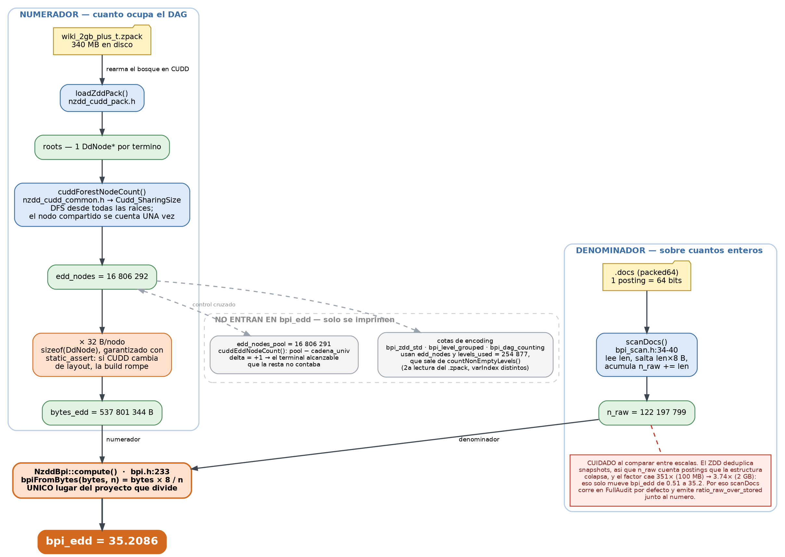

# Proyecto MAGISTER

Índice invertido versionado + **bosque ZDD^t** persistente en CUDD (pool compartido, serialización `.zpack`).

```
uiHRDC (only_list_and_voc) → .docs packed64 → zdd_cudd_plus_t → .zpack / logs CSV
                                                              ↘ optimize (post-build)
```

## Estructura del repo

| Ruta | Rol |
|------|-----|
| `plus_t/` | Motor ZDD Backbone 2 + headers `.zpack` |
| `edd_metatrie/` | EDD metatrie (intervalos / time-first trie) |
| `uiHRDC/` | Submódulo índice invertido / packed64 |
| `cudd/`, `TdZdd/` | Dependencias CUDD / TdZdd |
| `scripts/` | Pipelines, sweeps, notebooks, medidores |
| `scripts_deprecados/` | Código histórico (Backbone 1, TdZdd, …) |
| `docs/` | Guías + LaTeX; `docs/papers/` paper CLTJ |
| `datos_sinteticos/` | Recetas y salidas sintéticas |
| `resultados_test/` | Logs/CSV locales (**no versionar**) |
| `data/` | Artefactos grandes locales (**no versionar**) |
| `archive/` | Basura histórica sacada de la raíz |
| `BGPs/` | Referencia / clones (no embeber en git) |

## Documentación (dónde leer qué)

| Documento | Contenido |
|---|---|
| **[docs/PIPELINE_UIHRDC_CUDD.md](docs/PIPELINE_UIHRDC_CUDD.md)** | Guía operativa completa: pasos 1–4, modos CLI, arquitectura modular, verify, demo |
| **[docs/DATOS_SINTETICOS.md](docs/DATOS_SINTETICOS.md)** | Generador sintético, dualidad snapshots/intervalos, barrido U/V/tamaño + guardas OOM |
| **[docs/BACKBONE_2_LATEX.md](docs/BACKBONE_2_LATEX.md)** | Texto LaTeX Backbone 2 (`u+t` y `log`) |
| **[docs/METRICAS_LATEX.md](docs/METRICAS_LATEX.md)** | Sección LaTeX bpi: definiciones y tabla `plus_t_bpi_ladder` |
| **[edd_metatrie/README.md](edd_metatrie/README.md)** | EDD metatrie (intervalos) extraída de BGPs, input `.docs` |
| **[scripts/README.md](scripts/README.md)** | Notebooks, conversión `.docs`, medidor BPI, sintéticos |
| **[scripts/stress/README.md](scripts/stress/README.md)** | Stress campaign, dataset ladder |
| **[scripts_deprecados/README.md](scripts_deprecados/README.md)** | Código histórico (Backbone 1, TdZdd, experimentos) |
| **`THESIS_CONTEXTO_MAGISTER.md`** | Contexto tesis local (no versionar) |
| **`datos_sinteticos/`** | Salida canónica de barridos sintéticos (`.docs` / `.zpack` / CSV) |

## Flujo activo: `zdd_cudd_plus_t`

| | Valor |
|---|---|
| **Binario** | `zdd_cudd_plus_t` |
| **Fuente** | [`plus_t/`](plus_t/) — un solo módulo de reordenamiento en [`plus_t/cmd/optimize.h`](plus_t/cmd/optimize.h) |
| **Semántica** | `ZDD^t = F_t ∪ {{u+t}}` (`u+t`) o `F_t ∪ {φ(t)}` (`log`) |
| **docOffset** | `V + 1` (`u+t`) o `1 + ⌈log₂(V+1)⌉` (`log`) |

Un `.zpack` **no almacena** la codificación del tag: `load`/`verify`/`optimize` deben usar el mismo modo (`u+t` o `log`) que el build.

### Build vs reordenamiento

| Fase | Cuándo | Qué hace |
|---|---|---|
| **`build`** | Construcción término a término | Inserta `ZDD^t` en un **único `DdManager`** compartido. **No reordena.** |
| **`optimize`** | **Post-build**, sobre `.zpack` cargado | Permuta **niveles CUDD** en todo el manager (`ReduceHeap` / `ShuffleHeap`). Mide **EDD global** (`cuddForestNodeCount`). |

CUDD tiene autoreorden desactivado en build (`Cudd_AutodynDisableZdd` en `plus_t/nzdd_cudd_common.h`).

El arreglo `pointerList[t]` apunta a la raíz de cada término; el reordenamiento no “ordena el arreglo”, sino el **DAG compartido** debajo.

Reordenamiento incremental durante el build es posible en principio (p. ej. shuffle estático cada K términos), pero **no está implementado**; en 2 GB un `sift_conv` post-build puede superar 20 min.

## Compilación

```bash
cd /root/MAGISTER

# CUDD (una vez)
cd cudd/cudd && autoreconf -i && ./configure && make -j$(nproc) && cd ../../..

# Motor definitivo — tag u+t o log
g++ -O2 -std=c++17 -fopenmp -o zdd_cudd_plus_t plus_t/main.cpp \
  -I plus_t -I . -I ./cudd/cudd -I ./cudd -L ./cudd/cudd/.libs \
  -Wl,-rpath,'$ORIGIN/cudd/cudd/.libs' -lcudd \
  -I ./TdZdd/include \
  -I ./uiHRDC/uiHRDC/indexes/NOPOS/II_docs/src/utils

# Medidor BPI post-load (notebook celda 4)
g++ -O2 -std=c++17 -o scripts/measure_zpack_bpi scripts/measure_zpack_bpi.cpp \
  -I plus_t -I . -I ./TdZdd/include -I ./cudd -I ./cudd/cudd \
  -I ./cudd/st -I ./cudd/util -I ./cudd/mtr -I ./cudd/epd \
  -I ./uiHRDC/uiHRDC/indexes/NOPOS/II_docs/src/utils \
  -L ./cudd/cudd/.libs -Wl,-rpath,'$ORIGIN/cudd/cudd/.libs' -lcudd

# Auditor del denominador N (qué mide realmente Total_Ints)
g++ -O2 -std=c++17 -fopenmp -o scripts/audit_docs_ints scripts/audit_docs_ints.cpp \
  -I plus_t -I . -I ./TdZdd/include -I ./cudd -I ./cudd/cudd \
  -I ./uiHRDC/uiHRDC/indexes/NOPOS/II_docs/src/utils \
  -L ./cudd/cudd/.libs -Wl,-rpath,'$ORIGIN/cudd/cudd/.libs' -lcudd
```

## Modos CLI

| Modo | Comando base |
|---|---|
| **build** | `./zdd_cudd_plus_t build u+t\|log <docs> <voc> <out.zpack\|none> [max_terms] [log_csv] [log_every]` |
| **load** | `./zdd_cudd_plus_t load u+t\|log <in.zpack> [voc] [spot_word]` |
| **verify** | `./zdd_cudd_plus_t verify u+t\|log <docs> <voc> <tmp.zpack> [max_terms]` |
| **optimize** | `./zdd_cudd_plus_t optimize u+t\|log <in.zpack> <docs> <out\|none\|-> <heur> [max_sift_vars] [timeout_s]` |
| **optimize sweep** | `./zdd_cudd_plus_t optimize sweep u+t\|log <in.zpack> <docs> [max_sift] [timeout_s] [heur...]` |
| **demo** | `./zdd_cudd_plus_t demo u+t\|log [out_dir]` |
| **heuristics-check** | `./zdd_cudd_plus_t heuristics-check u+t\|log [out_dir]` |

### Ejemplos wiki

```bash
DOCS=resultados_test/wiki_1gb_uihrdc_packed64.docs
VOC=uiHRDC/uiHRDC/data/texts/index_wiki_1gb_named.voc

# build + persistir
./zdd_cudd_plus_t build u+t "$DOCS" "$VOC" resultados_test/wiki_1gb_plus_t.zpack 0

# build + CSV evolución (bpi_build pre-trim, diagnóstico)
./zdd_cudd_plus_t build u+t "$DOCS" "$VOC" none 0 resultados_test/cudd_evolucion_1gb_plus_t.csv 500

# verify (tags + round-trip + consultas CUDD + paridad build/loaded)
./zdd_cudd_plus_t verify u+t "$DOCS" "$VOC" resultados_test/wiki_1gb_plus_t_tmp.zpack 0
```

### Modo `optimize`

Toda la lógica vive en [`plus_t/cmd/optimize.h`](plus_t/cmd/optimize.h):

1. Carga `.zpack` + aplica heurística (`applyHeuristic` → `Cudd_zddReduceHeap` o `ShuffleHeap`).
2. Mide `edd_before/after`, **bpi_edd** (32 B/nodo × 8 / N), tiempo (`chrono`).
3. Verifica semántica (`Cudd_zddCountDouble` sobre muestra de roots).
4. Escribe CSV en `resultados_test/` (siempre append a `optimize_runs.csv`).

**Heurísticas permitidas (ZDD CUDD):**

- `baseline` — sin reordenar.
- Estáticas (solo masters): `nodes_desc`, `nodes_asc`, `df_desc`, `df_asc`.
- Dinámicas: `sift`, `sift_conv`, `symm_sift`, `symm_sift_conv`, `random`, `random_pivot`.
- Compuestas: `nodes_desc+sift_conv`, etc.
- **Prohibidas:** `linear*` (rompe var→master), `window*`, `annealing`, `genetic`, `exact`.

**Parámetro `timeout_s`:** `0` = sin límite; p. ej. `1200` corta cada heurística del sweep a los 20 min (fork + SIGKILL → fila `TIMEOUT` en CSV).

```bash
# Una heurística (2 GB, timeout 2 h)
./zdd_cudd_plus_t optimize log \
  resultados_test/wiki_2gb_plus_t_bin.zpack \
  resultados_test/wiki_2gb_uihrdc_packed64.docs \
  none sift_conv 200 7200

# Barrido con timeout por heurística
./zdd_cudd_plus_t optimize sweep log \
  resultados_test/wiki_2gb_plus_t_bin.zpack \
  resultados_test/wiki_2gb_uihrdc_packed64.docs \
  200 1200 baseline df_desc df_asc sift sift_conv symm_sift_conv
```

### Semántica del reordenamiento

Con las heurísticas **permitidas**, el reorder **no cambia** la familia de conjuntos de cada $\mathrm{ZDD}^{t}$: solo permuta **niveles** CUDD (`Cudd_zddShuffleHeap` / `Cudd_zddReduceHeap`). La respuesta a consultas (pertenencia, enumeración) es la **misma**; $|ZDD^{t}|$ no cambia. Lo que sí puede cambiar es el **tamaño del DAG** (`edd_nodes`, `bpi_edd`) y, con ello, el **coste** de operaciones CUDD.

Verificación en código: `familyChecksums` → `Cudd_zddCountDouble` antes/después (`semantics_ok` en CSV de `optimize`). **Prohibidas** `linear*` (rompen `var → master`).

### Check visual y semántico de heurísticas

Script: [`scripts/analisis_heuristicas_check.py`](scripts/analisis_heuristicas_check.py)

```bash
python3 scripts/analisis_heuristicas_check.py
# reutilizar CSV/PNG ya generados (solo mosaico + panel):
python3 scripts/analisis_heuristicas_check.py --skip-cpp
```

Salida en **`resultados_test/heuristics_check/`**:

| Archivo | Contenido |
|---|---|
| `heuristics_check.csv` | Toy (u=4, V=2): 14 heurísticas, `semantics_ok`, `families_equal`, Δ nodos |
| `mosaico_heuristicas.png` | Grid 4×4: bosque ZDD tras cada heurística |
| `panel_empirico_100mb.png` | Sweep real 100 MB: `bpi_edd`, `semantics_ok`, tiempo |
| `<heur>/bosque.png` | DAG individual (p. ej. `sift_conv/bosque.png`) |

Última corrida toy: **14/14** con `semantics_ok=1` y familias idénticas antes/después.

## Métricas BPI (plus_t)

Toda la aritmética vive en [`plus_t/utils/bpi.h`](plus_t/utils/bpi.h) (`NzddBpi::compute()`). Escaneo de denominadores: [`plus_t/utils/bpi_scan.h`](plus_t/utils/bpi_scan.h).

Flujo completo de `bpi_edd`, del `.zpack` y el `.docs` hasta el número — fuente en [`docs/bpi_edd_flujo.dot`](docs/bpi_edd_flujo.dot), se regenera con `dot -Tpng -Gdpi=150 docs/bpi_edd_flujo.dot -o docs/bpi_edd_flujo.png`:



Un posting packed64 es **un** entero: el par `(master, rel)` indivisible (baseline 64 bpi).

### Denominadores (cuatro formas de contar N)

| Denominador | Qué cuenta | Uso |
|-------------|------------|-----|
| **`n_raw`** (`Total_Ints`) | Suma de `len` en posting lists | Métrica principal de cara al índice; comparable con PEF (~6 bpi) |
| **`n_pairs_uniq`** | Pares `(master,rel)` distintos por término | Sanidad: detecta duplicados literales en el `.docs` |
| **`n_snap_elems`** | Elementos en snapshots **distintos** (mismo criterio que el build) | Lo que el DAG realmente materializa |
| **`n_masters_uniq`** | Masters distintos por término | Índice sin versionado |

El escaneo profundo (`FullAudit`) es la única vía a `n_snap_elems`, y sin él no hay `ratio_raw_over_stored`, que es lo que hace interpretable a `bpi_edd`. Por eso en `measure_zpack_bpi` va **por defecto** (`raw` como tercer argumento, o `NZDD_BPI_AUDIT=0`, lo desactiva). En `optimize` sigue siendo opt-in con `NZDD_BPI_AUDIT=1`, porque ahí lo que interesa es `delta_pct` entre antes y después y el denominador se cancela. También disponible aparte: `scripts/audit_docs_ints <docs>`.

**Artefacto de escala:** `n_raw / n_snap_elems` no es constante (351× en 100 MB, 5.9× en 1 GB, 3.7× en 2 GB). Por eso `bpi_edd` sobre `n_raw` parece caer de 0.51 a 35 bpi al escalar, aunque sobre `n_snap_elems` la curva es plana (~130 bpi). Reportar solo `n_raw` mezcla compresión real con colapso de redundancia del denominador.

### Numeradores

| Métrica | Numerador | Uso |
|---------|-----------|-----|
| **bpi_edd** | `edd_nodes × 32 B/nodo × 8 bit/B` = `edd_nodes × 256 bits` / n_raw | **Principal** — RAM del DAG |
| **bpi_file** | `\|.zpack\|` (20 B/nodo en disco) | Persistencia |
| **bpi_mem** / **bpi_build** | `Cudd_ReadMemoryInUse` | Diagnóstico (proceso completo, pre-trim en build) |

De los 32 B de `DdNode` sólo 20 son información del DAG (`index` u32 + dos punteros); `ref` y `next` son bookkeeping del motor de construcción. `edd_nodes` es el conteo **exacto por alcanzabilidad** desde las raíces (`cuddForestNodeCount`, sobre `Cudd_SharingSize`); la resta `pool − cadena_univ` (`cuddEddNodeCount`) queda como control cruzado en `edd_nodes_pool`. Difieren en los terminales alcanzables: +2 a 100 MB, +1 a 1–2 GB.

**Cuidado al comparar `bpi_edd` entre escalas.** El ZDD deduplica snapshots, así que `n_raw` cuenta postings que la estructura colapsa, y el factor de deduplicación se desploma con la escala: 351× a 100 MB, 5.86× a 1 GB, 3.74× a 2 GB. Eso solo mueve `bpi_edd` de 0.51 a 35.2. La métrica intrínseca es `bpi_edd_over_stored` (sobre `n_snap_elems`): 178.9 → 125.0 → 131.8. Reportar siempre `ratio_raw_over_stored` al lado.

### Cotas de encoding

Derivadas de `edd_nodes` (N) y `levels_used` (L) — no se miden. Ya **no** requieren `NZDD_BPI_AUDIT`.

| Métrica | Bits totales | 2 GB opt |
|---------|--------------|----------|
| **bpi_zdd_std** | `2N⌈log₂(N+1)⌉ + N⌈log₂(L+1)⌉` | 7.00 |
| **bpi_level_grouped** | `2N⌈log₂(N+1)⌉ + L⌈log₂(N+1)⌉` | 5.51 |
| **bpi_dag_counting** | `2·log₂((N+1)!) + L⌈log₂(N+1)⌉` | 5.12 |

`L` son los niveles que el DAG ocupa de verdad, exactos vía `varIndex` distintos del `.zpack` (`countNonEmptyLevels`). Medido: `L = numZddVars − 1` en los seis puntos del ladder, así que no cambia nada — el campo existe para dejar probado que las cotas no cobran niveles vacíos. `optimize` no tiene el `.zpack` a mano y usa `numZddVars`, marcándolo con `levels_exact=0`.

`bpi_zdd_std` **no es una cota inferior**: es la línea base *standard ZDD* de la literatura (Matsuda–Denzumi–Sadakane 2021), por debajo de la cual quedan DenseZDD y Top ZDD. El piso real es `bpi_dag_counting`. Las claves `bpi_edd_min` (alias literal de `bpi_zdd_std`) y `bits_per_stored_elem` (idéntica a `bpi_edd_over_stored`) fueron **eliminadas**. Detalle, valores por escala y comparación con PEF/OptPFD en [`docs/METRICAS_LATEX.md`](docs/METRICAS_LATEX.md).

`bpi_mem` incluye caché, subtablas, slots de hash, cadena `univ` y nodos muertos (~97 % overhead en wiki_100mb). Ver desglose en `scripts/measure_zpack_bpi`.

## Notebook [`scripts/analisis_CUDD.ipynb`](scripts/analisis_CUDD.ipynb)

| Celda | Contenido | Logs / salida |
|---|---|---|
| **1** | Evolución del build (pool, memoria, **bpi_build**) | `cudd_evolucion_<scale>_plus_t[_log].csv` — config: `DATASET_NAME`, `ENCODING` |
| **2** | Versionado del `.docs` packed64 | histogramas / tabla exploratoria |
| **3** | Resumen build | métricas finales pre-trim |
| **4** | **Ladder BPI operativa** (100 MB / 1 GB / 2 GB × u+t / log) | `plus_t_bpi_ladder.csv`, `.png` — **métrica definitiva** |
| **5** | Reordenamiento **100 MB** | `plot_optimize_sweep('wiki_100mb_plus_t', …)` |
| **6** | Reordenamiento **2 GB** | `plot_optimize_sweep('wiki_2gb_plus_t_bin', …)` |
| **7** | Reordenamiento **1 GB** | `plot_optimize_sweep('wiki_1gb_plus_t_bin', …)` |

Celdas 5–7: leen `optimize_sweep_<pack>_*.csv` (elige el CSV con **más filas**). Tres paneles: **bpi_edd**, **Δ% vs baseline**, **tiempo**. Filas **`TIMEOUT`** en gris rayado.
## Logs en `resultados_test/` (referencia rápida)

| Archivo | Origen |
|---|---|
| `cudd_evolucion_2gb_plus_t.csv` | build 2 GB u+t (celda 1) |
| `optimize_runs.csv` | append maestro de todas las corridas `optimize` |
| `optimize_sweep_wiki_100mb_plus_t_*.csv` | barrido 100 MB (14/14 ok) |
| `optimize_sweep_wiki_1gb_plus_t_bin_*.csv` | barrido 1 GB (13 ok + 1 TIMEOUT) |
| `optimize_sweep_wiki_2gb_plus_t_bin_COMPLETE.csv` | barrido 2 GB completo (9 ok + 5 TIMEOUT) |
| `heuristics_check/` | check semántico + mosaico PNG (script `analisis_heuristicas_check.py`) |
| `plus_t_bpi_ladder.csv` | celda 4 |

### Barridos `optimize sweep` — timeouts (`timeout_s`)

Barrido multi-escala **terminado**: [`resultados_test/run_optimize_sweeps_all.sh`](resultados_test/run_optimize_sweeps_all.sh)
(+ reanudación 2 GB: [`run_optimize_2gb_resume.sh`](resultados_test/run_optimize_2gb_resume.sh)).

| Escala | Pack | `timeout_s` | Equiv. | Motivo del umbral |
|---|---|---|---|---|
| **100 MB** | `wiki_100mb_plus_t.zpack` | **600** | **10 min** | Previo max ~142 s (`random_pivot`) |
| **1 GB** | `wiki_1gb_plus_t_bin.zpack` | **7200** | **2 h** | Previo `nodes_desc+sift` ~15 min |
| **2 GB** | `wiki_2gb_plus_t_bin.zpack` | **10800** | **3 h** | Previo `sift*` TIMEOUT @ 20 min |

14 heurísticas, `max_sift_vars=200`. Si supera el umbral → CSV `TIMEOUT` (no modifica el pack).

### Resultados empíricos de reordenamiento

| Escala | Mejor ok | bpi_edd | Tiempo | Notas |
|---|---|---|---|---|
| 100 MB | `sift_conv` | 0.499 (−2.0 %) | ~1.6 s | 14/14 ok |
| 1 GB | `df_desc+sift_conv` | 16.48 (−23.9 %) | ~66 min | 13 ok; `nodes_desc+sift_conv` TIMEOUT @ 2 h |
| 2 GB | `nodes_desc+sift` | 29.36 (−17.2 %) | ~33 min | 9 ok; `*_conv` + `random_pivot` TIMEOUT @ 3 h (5/14) |

```bash
# CSV canónico 2 GB
resultados_test/optimize_sweep_wiki_2gb_plus_t_bin_COMPLETE.csv
```

## Archivos clave

| Ubicación | Rol |
|---|---|
| [`plus_t/main.cpp`](plus_t/main.cpp) | Dispatch CLI |
| [`plus_t/engine/engine.h`](plus_t/engine/engine.h) | Build del bosque (`buildForest`, `buildFtPointersForRange`) |
| [`plus_t/cmd/heuristics_check.h`](plus_t/cmd/heuristics_check.h) | Modo `heuristics-check`: toy + verificación semántica + DOT/PNG |
| [`plus_t/cmd/optimize.h`](plus_t/cmd/optimize.h) | Reordenamiento + sweep + timeout + CSV |
| [`plus_t/export/export.h`](plus_t/export/export.h) | Save, spot-check, consultas verify |
| [`plus_t/nzdd_cudd_common.h`](plus_t/nzdd_cudd_common.h) | I/O `.voc`/`.docs`, `cuddForestNodeCount`, config CUDD |
| [`plus_t/nzdd_cudd_pack.h`](plus_t/nzdd_cudd_pack.h) | Formato `.zpack` v1/v2 (`invPerm` tras reorder) |
| [`plus_t/utils/bpi.h`](plus_t/utils/bpi.h) | **BPI centralizado**: `compute`, `printReport` |
| [`plus_t/utils/bpi_scan.h`](plus_t/utils/bpi_scan.h) | Escaneo de denominadores sobre `.docs` |
| [`scripts/measure_zpack_bpi.cpp`](scripts/measure_zpack_bpi.cpp) | Medidor bpi_edd / bpi_file / bpi_mem post-load |
| [`scripts/audit_docs_ints.cpp`](scripts/audit_docs_ints.cpp) | Auditoría de los cuatro denominadores |
| [`scripts/analisis_heuristicas_check.py`](scripts/analisis_heuristicas_check.py) | Check semántico + mosaico visual de las 14 heurísticas |
| [`scripts/analisis_CUDD.ipynb`](scripts/analisis_CUDD.ipynb) | Análisis build + ladder + reorder 100 MB / 2 GB |

## Flujos históricos (deprecados)

Backbone 1 (`F_t` sin tags), baselines TdZdd y experimentos C++ archivados en **[scripts_deprecados/](scripts_deprecados/)**. No forman parte del pipeline activo.
